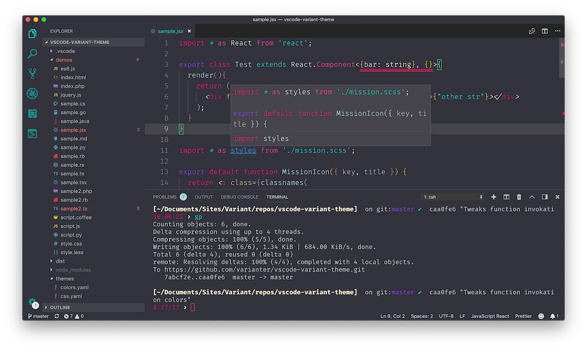

# Variant Theme

**Currently work in progress. Not yet available on markedplace.**

## Installation

1. Open the **Extensions** sidebar in VS Code. `View → Extensions`
1. Search for `Variant`, choose "Variant Theme" by **mikaelbr**
1. Click **Install** to install it
1. Click **Reload** to reload your editor
1. Navigate to File > Preferences > Color Theme > **Variant Theme** or any of the variants listed

## Thanks

This theme is based on the [Panda VSCode theme](https://github.com/tinkertrain/panda-syntax-vscode).
